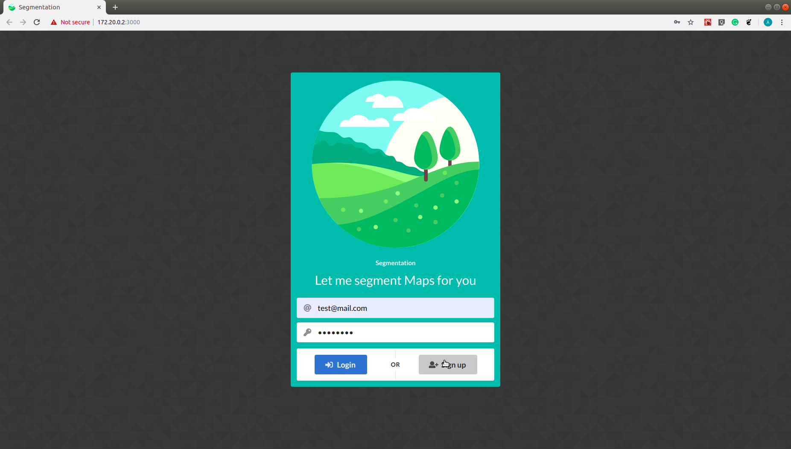
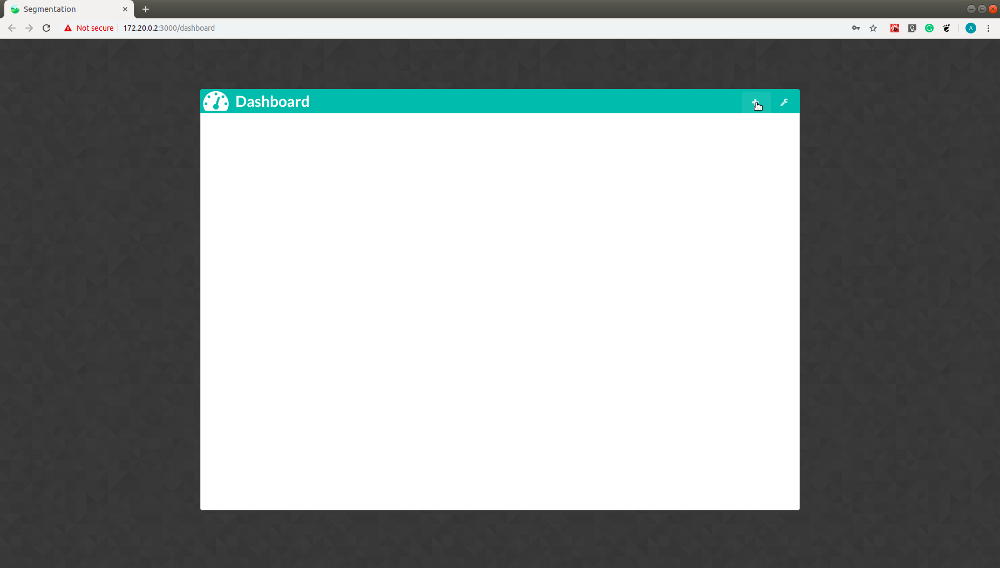
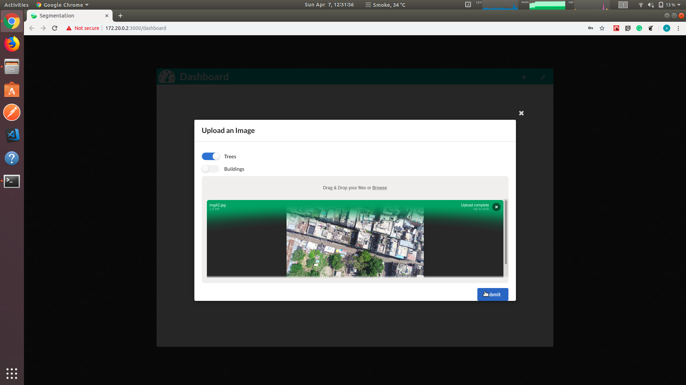
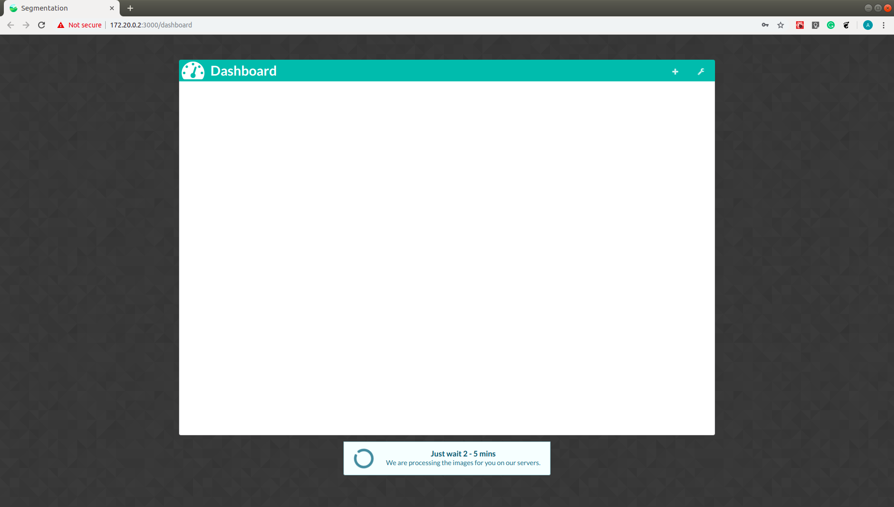
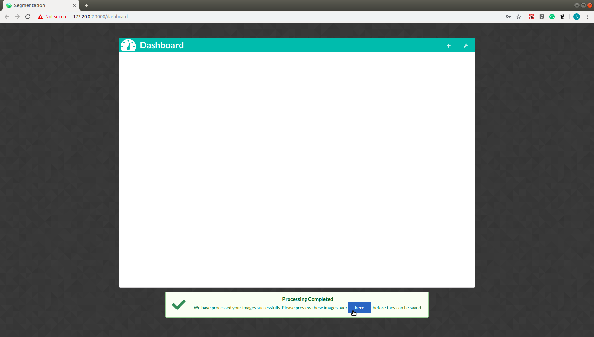
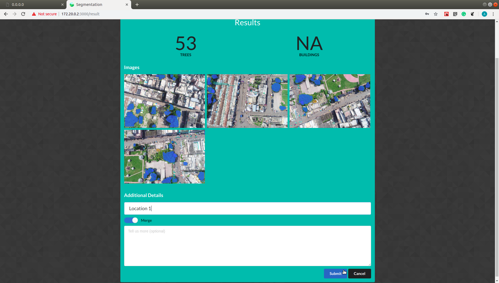
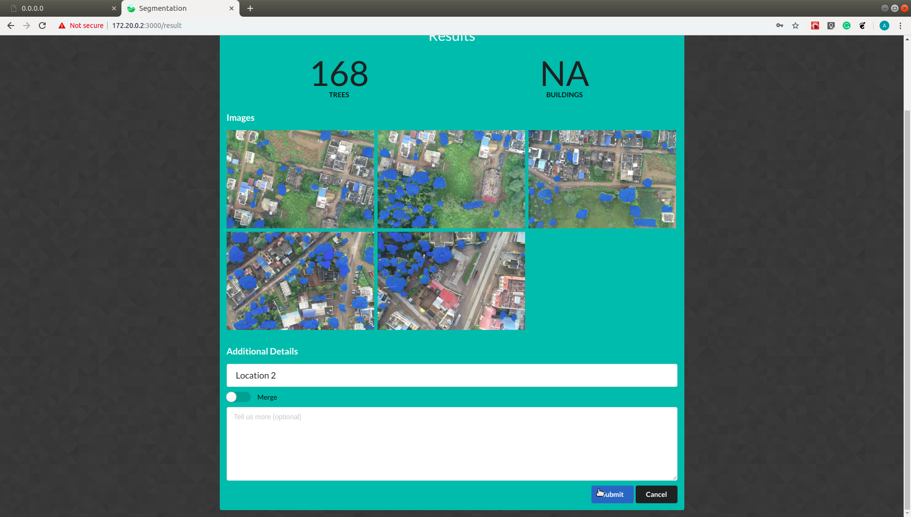
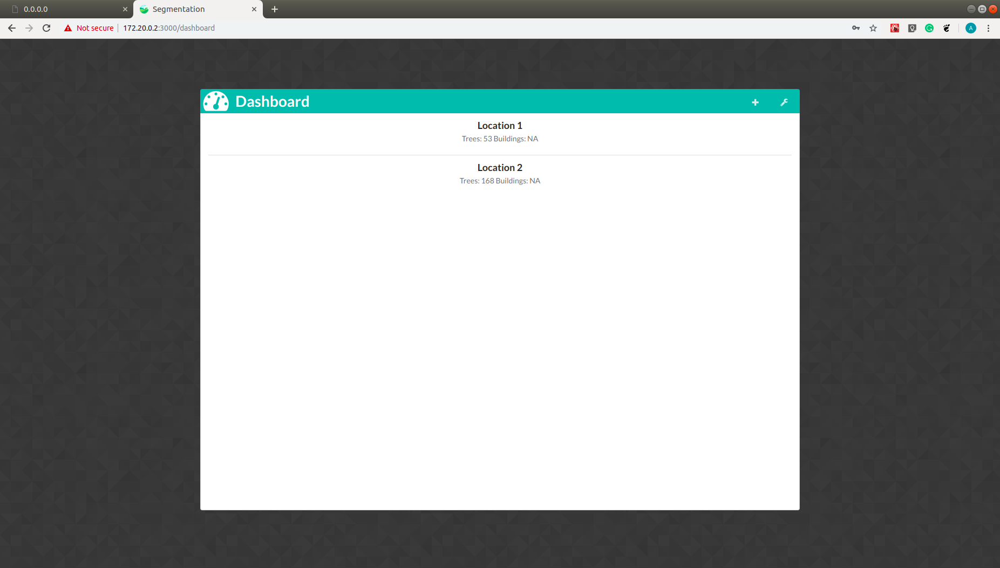

# Tree segmentation in aerial images
## Introduction
This is the second in the series of repositories in development of the Smart City Planner research project I have been involved with for the past year.

Traditionally municipal corporations have to rely on manual counting of trees for monitoring tree cover statistics. This task requires a lot of manual effort, time and substantial capital investment. As a result, municipal corporations cannot sample this data at regular intervals of time. The resource-intensive nature of the task makes it difficult to efficiently deploy countermeasures against illicit activities like unauthorized tree cutting. An efficient solution to this problem is proposed, utilizing deep learning techniques for tree segmentation on aerial images.

## The Application
A web-app based on Flask-React stack for segmenting trees from images

## Dependencies
1. Linux/Mac
2. Docker

## Running Server
**Linux/Mac**
```console
foo@bar:~$ sudo docker-compose up
```

## Stopping Server
**Linux/Mac**  
Use ```Ctrl+C```

## Notes
1. Always use ```Ctrl + C``` and not ```Ctrl + X```

## The User Interface
The landing page prompts the user to first signup (or signin) and then upload images (single or multiple) as shown: (The uploaded images must have the GPS data as its meta data)






Once uploaded the user can choose to either test the tree detection algorithm, building detection algorithm or both. (The building detection stage is still in beta stage). The processing usually takes 1-2 minutes per image to process on a CPU based server.



Once processed the result is shown as follows.



The images are clustered together according to the geolocation area they belong to, for representational purposes. The tree count, geolocation and date-time of processing for each image is saved for the signed in user. (To be used for comparision purposes)

## How does it work?
Tree segmentation is carried out for a given area at different points in time and the corresponding results are compared. The approach consists of three stages:
* The received instance is classified as either an image or an orthomosaic map whereby in the latter case, the instance is further divided into smaller images. 
* Tree segmentation and instance counting is achieved using a Mask R-CNN based object detector. 
* Data comparison metrics are provided to compare the tree cover statistics in a particular area. This is achieved using the image’s Ground Sampling Distance (GSD) computed using its 3D position data, camera parameters.

## Dataset
One of the driving motives for us in the project was to successfully train a model on our custom dataset, which consists of thousands of aerial images, collected over various Indian settings. A small subset of the dataset was annotated, using it as the training set.
